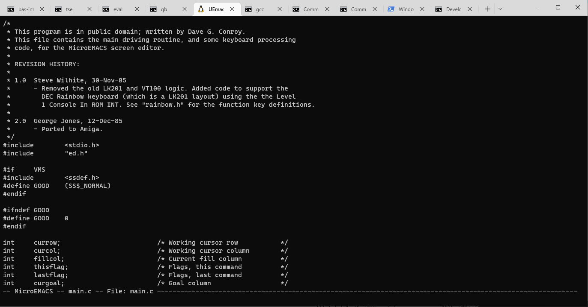
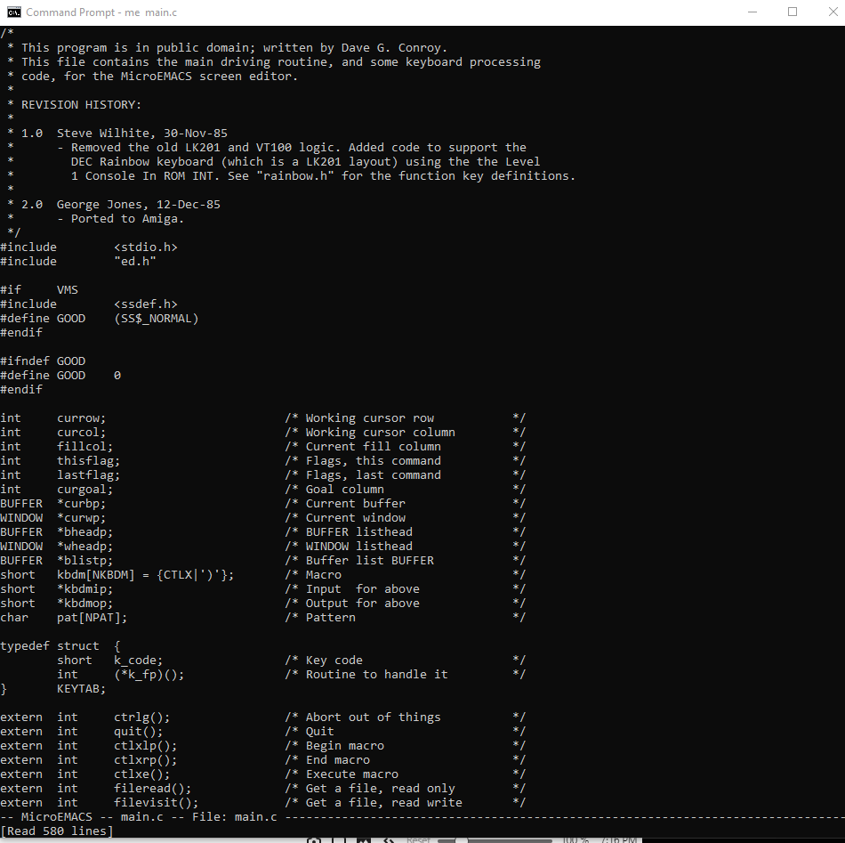

# MicroEmacs

This is Dave Conroy's venerable/ubiquitous December 1985 version of microemacs/uemacs, with minimal updates to allow it to compile on Windows 7+, Linux, Cygwin and MSYS2.

To build, simply run make.  It should compile on Linux or Windows.

Compiles to a 30k .exe on 64-bit Windows; 39k executable on 64-bit Linux.

Running on Ubuntu20.4 under WSL:

Running on Windows10:

